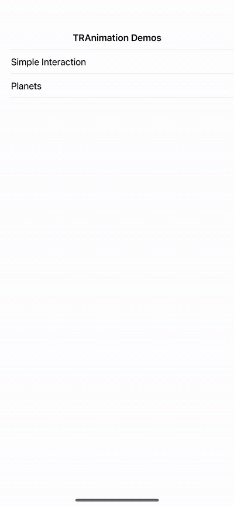

# TRAnimation

TRAnimation is a lite, cross-platform sprite animation & interaction framework for XOJO.

This framework is being developed in conjunction with commercial apps to be released by tinrocket.com and capsuleapps.com. One of these apps is Photo Tape:

Current limitations:

1) The render model is based on the Graphics class; there is no hardware acceleration. That said, it's fast enough for dozens of animated sprites. TRAnimation could be adapted to another display model if one were implemented in XOJO.

2) TRAnimation is limited to macOS and iOS platforms because of dependency on CGAffineTransform. This dependency will be removed in the future.

XOJO forum announcement and discussion: https://forum.xojo.com/t/new-sprite-2d-scene-graph-interaction-framework/72542/10

